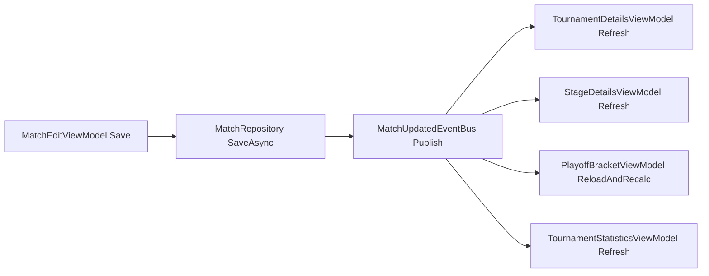

# Доработка Live-матчей и стартового UI

## Подтверждённые требования

- Для `InProgress` матча нужен **промежуточный live-пересчёт**: при изменении счёта/периодов сразу видны изменения.
- Синхронизация экранов — через **внутренние события приложения** (без таймерного polling).
- На стартовом экране убрать отображение literal-строк вида `{x:Static res:App...}`.

## Что найдено в коде

- Редактирование матча сейчас не даёт ввод периодов для `InProgress` (только для `Finished`) в [Presentation/ViewModels/MatchEditViewModel.cs](Presentation/ViewModels/MatchEditViewModel.cs) и [Presentation/Views/MatchEditPage.xaml](Presentation/Views/MatchEditPage.xaml).
- Таблицы считаются только по `Finished` в [Domain/StatsService.cs](Domain/StatsService.cs) и [Presentation/ViewModels/StandingsSectionBuilder.cs](Presentation/ViewModels/StandingsSectionBuilder.cs).
- Плей-офф-серия считает победы только по `Finished` матчам в [Presentation/ViewModels/PlayoffBracketViewModel.cs](Presentation/ViewModels/PlayoffBracketViewModel.cs).
- На стартовом экране literal появляется в `Picker.Items` в [MainPage.xaml](MainPage.xaml).

## Архитектура live-синхронизации

## План изменений

- Ввести простой внутренний event-bus для изменений матчей:
  - добавить сервис уведомлений (например `IMatchUpdatesNotifier`) и зарегистрировать его в DI в [MauiProgram.cs](MauiProgram.cs);
  - публиковать событие после успешного сохранения матча в [Presentation/ViewModels/MatchEditViewModel.cs](Presentation/ViewModels/MatchEditViewModel.cs);
  - подписать ключевые VM на событие и выполнять безопасный async refresh (с проверкой текущего `TournamentId`/`StageId`).
- Включить live-ввод периодов для матча `InProgress`:
  - обновить видимость блоков в [Presentation/Views/MatchEditPage.xaml](Presentation/Views/MatchEditPage.xaml), чтобы периоды были доступны не только для `Finished`, но и для `InProgress`;
  - в [Presentation/ViewModels/MatchEditViewModel.cs](Presentation/ViewModels/MatchEditViewModel.cs) сохранять `PeriodScores` и агрегировать `HomeGoals/AwayGoals` при `InProgress` на основе введённых периодов (без обязательного определения `OutcomeType`/победителя как для `Finished`).
- Сделать live-пересчёт таблиц с учётом `InProgress` (промежуточно):
  - расширить расчёт в [Domain/StatsService.cs](Domain/StatsService.cs): добавить режим/перегрузку, где `InProgress` участвуют как «текущее состояние матча»;
  - использовать live-режим на экранах с таблицами: [Presentation/ViewModels/TournamentDetailsViewModel.cs](Presentation/ViewModels/TournamentDetailsViewModel.cs), [Presentation/ViewModels/StandingsSectionBuilder.cs](Presentation/ViewModels/StandingsSectionBuilder.cs), при необходимости [Presentation/ViewModels/TournamentStatisticsViewModel.cs](Presentation/ViewModels/TournamentStatisticsViewModel.cs).
- Обновлять плей-офф в live-режиме:
  - в [Presentation/ViewModels/PlayoffBracketViewModel.cs](Presentation/ViewModels/PlayoffBracketViewModel.cs) для `ScoreText` серии считать текущий счёт серии с учётом `Finished + InProgress` матчей;
  - победителя серии и продвижение в следующий раунд оставить как сейчас (только после достаточного числа `Finished`), чтобы не ломать логику bracket-advance.
- Исправить стартовый экран:
  - в [MainPage.xaml](MainPage.xaml) убрать literal `Picker.Items` с `{x:Static ...}`;
  - заполнить `ThemePicker` локализованными строками в code-behind [MainPage.xaml.cs](MainPage.xaml.cs) через `AppResources`, чтобы исключить повторение проблемы разметки.

## Проверка после реализации

- При редактировании live-матча изменение периодов сразу отражается:
  - на домашнем экране турнира (live/последние/ближайшие);
  - на экране стадии (матчи и таблица стадии);
  - на экране сетки плей-офф (счёт серии).
- После перевода матча в `Finished` официальные таблица и продвижение по сетке остаются корректными.
- На стартовом экране больше не отображается текст вида `{x:Static res:App...}`; в picker видны корректные локализованные значения темы.

