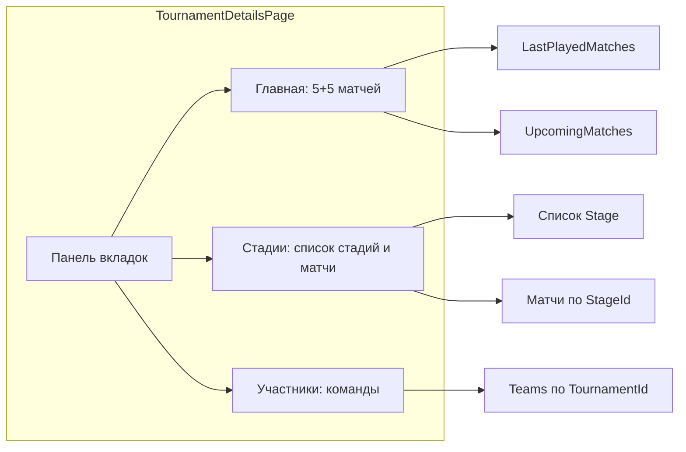

# План: вкладки турнира, главная, стадии, участники

## Текущее состояние

- **Экран деталей турнира:** [TournamentDetailsPage.xaml](Presentation/Views/TournamentDetailsPage.xaml) — один длинный `ScrollView` с названием, кнопками «Команды»/«Группы», статусом, правилами, таблицей, текущими матчами и списком матчей.
- **Матчи:** домен [Match](Domain/Match.cs) без привязки к стадии; репозиторий [MatchRepository](Data/MatchRepository.cs) — выборка по `TournamentId`.
- **Команды:** отдельная страница [TeamsListPage](Presentation/Views/TeamsListPage.xaml) с переходом по кнопке «Команды».

---

## 1. Нижняя панель переключения контента

**Разметка:** перестроить [TournamentDetailsPage.xaml](Presentation/Views/TournamentDetailsPage.xaml):

- Корневой layout: `Grid` с двумя строками — контент (например `*`) и нижняя панель (`Auto`).
- Нижняя панель: горизонтальный ряд из трёх кнопок/элементов: «Главная», «Стадии», «Участники» (внешний вид — как сегментированный выбор: одна активная).
- Контент: один контейнер (например `ContentView` или `ScrollView`), внутри которого в зависимости от выбранного индекса показывается одно из трёх представлений (см. ниже).

**ViewModel:** в [TournamentDetailsViewModel.cs](Presentation/ViewModels/TournamentDetailsViewModel.cs) добавить свойство `SelectedTabIndex` (0 = Главная, 1 = Стадии, 2 = Участники) и при смене индекса обновлять отображаемый контент. В code-behind — привязка кнопок к выбору вкладки.

**Реализация в XAML:** три кнопки с привязкой `Command` или `Clicked` на установку `SelectedTabIndex`; видимость/контент блоков «Главная», «Стадии», «Участники» через привязку к `SelectedTabIndex` (например, конвертер видимости или отдельные `ContentPresenter` с разным контентом и видимостью).

---

## 2. Вкладка «Главная»

**Содержимое (вместо текущего «всего подряд» на главной):**

- **5 последних сыгранных матчей:** матчи со статусом `Finished`, сортировка по дате по убыванию, взять 5. Отображение в том же формате, что и сейчас (дата, команды, счёт), без кнопки «Начать матч».
- **5 следующих матчей:** матчи со статусом `Scheduled` или `InProgress`, сортировка по дате по возрастанию, взять 5. Для «Scheduled» — кнопка «Начать матч», для «InProgress» — «Завершить матч» (как сейчас).

На главной можно оставить только эти два блока (и при необходимости краткую сводку: название турнира, статус). Таблицу, правила и описание можно оставить на главной или вынести в отдельные места по желанию (в плане — оставить на главной под блоками матчей, чтобы не дробить экран).

**ViewModel:** в `LoadAsync` после загрузки матчей формировать:

- `LastPlayedMatches` — до 5 элементов `MatchRow` из завершённых;
- `UpcomingMatches` — до 5 элементов `MatchRow` из запланированных + текущих (по дате вперёд).

Типы `ObservableCollection<MatchRow>`, привязка в XAML к `LastPlayedMatches` и `UpcomingMatches` с заголовками «Последние матчи» / «Ближайшие матчи».

---

## 3. Стадии турнира

**Домен и БД:**

- **Новая сущность Stage:** [Domain/Stage.cs](Domain/Stage.cs) — `Id`, `TournamentId`, `Name`, `Order` (int), `StageType` (enum: Swiss, PlayOff).
- **Enum:** в [Domain/Enums.cs](Domain/Enums.cs) добавить `StageType { Swiss, PlayOff }`.
- **Match:** в [Domain/Match.cs](Domain/Match.cs) добавить nullable `Guid? StageId`. Матч может быть без стадии (для обратной совместимости) или относиться к одной стадии.
- **БД:** в [Data/Entities.cs](Data/Entities.cs) — таблица `StageEntity` (Id, TournamentId, Name, Order, StageType); в `MatchEntity` — поле `StageId` (nullable Guid). В [Data/LocalDatabase.cs](Data/LocalDatabase.cs) — `CreateTableAsync<StageEntity>()`, миграция `ALTER TABLE Matches ADD COLUMN StageId TEXT` (SQLite хранит Guid как текст).
- **Репозиторий стадий:** интерфейс `IStageRepository` и реализация `StageRepository` — `GetByTournamentAsync`, `GetByIdAsync`, `SaveAsync`, `DeleteAsync`. Регистрация в [MauiProgram.cs](MauiProgram.cs).

**Репозиторий матчей:** в [IMatchRepository](Data/MatchRepository.cs) добавить метод `GetByStageAsync(Guid stageId)` (или оставить выборку по турниру и фильтровать по `StageId` в ViewModel). Предпочтительно: `GetByTournamentAsync` по-прежнему возвращает все матчи турнира; в коде фильтрация по `StageId`. При добавлении матча из контекста стадии передавать `StageId` в `MatchEditPage`.

**Экран «Стадии» (внутри вкладки):**

- Список стадий турнира (имя, тип: Швейцарская / Плей-офф). Кнопка «Добавить стадию» → экран/модалка создания стадии (название, тип, порядок).
- При выборе стадии — показать матчи этой стадии (список как сейчас: дата, команды, счёт, кнопки «Начать»/«Завершить») и кнопку «Добавить матч» (переход на `MatchEditPage` с параметрами `TournamentId` и `StageId`).

**ViewModel:** в `TournamentDetailsViewModel` (или отдельный под-ViewModel для стадий) — коллекция стадий, выбранная стадия, матчи выбранной стадии. Загрузка стадий в `LoadAsync`; при выборе стадии — фильтрация матчей по `StageId` и заполнение списка матчей стадии.

**MatchEdit:** в [MatchEditViewModel](Presentation/ViewModels/MatchEditViewModel.cs) и [MatchEditPage](Presentation/Views/MatchEditPage.xaml.cs) добавить опциональный query-параметр `StageId`; при сохранении матча выставлять `Match.StageId` если передан.

---

## 4. Вкладка «Участники»

**Содержимое:** список команд турнира + кнопка «Добавить команду». Логику и отображение взять с [TeamsListPage](Presentation/Views/TeamsListPage.xaml) (карточки команд, свайп на удаление, тап — редактирование).

**Реализация:** в `TournamentDetailsViewModel` при загрузке турнира уже получать команды (`_teamRepository.GetByTournamentAsync`) и выставить коллекцию `Teams` (или `ParticipantTeams`) для привязки. На вкладке «Участники» показывать `CollectionView` с тем же шаблоном, что на TeamsListPage (или упрощённый). Кнопка «Добавить» — переход на `TeamEditPage?TournamentId=...`; тап по команде — `TeamEditPage?TournamentId=...&TeamId=...`; удаление — вызов репозитория и обновление списка. Кнопки «Команды» и «Группы» можно оставить в шапке деталей турнира или перенести в блок настроек; «Участники» тогда дублируют функциональность «Команды» в виде вкладки — кнопку «Команды» можно убрать или оставить как альтернативный вход.

---

## 5. Порядок внедрения и миграции данных

- Добавить домен `Stage`, enum `StageType`, поле `StageId` в `Match` и маппинг в репозиториях.
- Миграция БД и создание `StageRepository`.
- UI: нижняя панель и переключение трёх вкладок; контент «Главная» с `LastPlayedMatches` и `UpcomingMatches`.
- Реализовать экран/блок стадий: список стадий, выбор стадии, матчи стадии, добавление матча с `StageId`.
- Реализовать вкладку «Участники» с списком команд и переходами на добавление/редактирование.
- Для существующих турниров: матчи без `StageId` остаются «вне стадии»; на главной они участвуют в «5 последних / 5 ближайших»; в блоке «Стадии» можно показывать опцию «Все матчи без стадии» или не показывать их в стадиях до ручного переноса (на усмотрение).

---

## Схема потока данных (вкладки и стадии)

---

## Ключевые файлы для изменений

| Задача                  | Файлы                                                                                                                                                                                                                                                  |
| ----------------------- | ------------------------------------------------------------------------------------------------------------------------------------------------------------------------------------------------------------------------------------------------------ |
| Панель и вкладки        | [TournamentDetailsPage.xaml](Presentation/Views/TournamentDetailsPage.xaml), [TournamentDetailsPage.xaml.cs](Presentation/Views/TournamentDetailsPage.xaml.cs), [TournamentDetailsViewModel.cs](Presentation/ViewModels/TournamentDetailsViewModel.cs) |
| Главная: 5+5            | [TournamentDetailsViewModel.cs](Presentation/ViewModels/TournamentDetailsViewModel.cs) (коллекции и логика выборки)                                                                                                                                    |
| Домен стадий            | [Domain/Stage.cs](Domain/Stage.cs) (новый), [Domain/Enums.cs](Domain/Enums.cs), [Domain/Match.cs](Domain/Match.cs)                                                                                                                                     |
| БД и репозиторий стадий | [Data/Entities.cs](Data/Entities.cs), [Data/LocalDatabase.cs](Data/LocalDatabase.cs), [Data/MatchRepository.cs](Data/MatchRepository.cs), новый StageRepository, [MauiProgram.cs](MauiProgram.cs)                                                      |
| Матч и стадия           | [Presentation/ViewModels/MatchEditViewModel.cs](Presentation/ViewModels/MatchEditViewModel.cs), [Presentation/Views/MatchEditPage.xaml.cs](Presentation/Views/MatchEditPage.xaml.cs)                                                                   |
| Участники               | Данные в TournamentDetailsViewModel, разметка в [TournamentDetailsPage.xaml](Presentation/Views/TournamentDetailsPage.xaml) (блок для вкладки «Участники»)                                                                                             |

Строки локализации для «Главная», «Стадии», «Участники», «Последние матчи», «Ближайшие матчи», «Добавить стадию» и т.д. добавить в ресурсы приложения (например, [Resources/AppResources.resx](Resources/AppResources.resx) или аналог).