# План: новый функционал турнирной таблицы, правил, групп и периодов

## 1. Новые критерии в турнирной таблице

**Уже есть в модели:** Games, GoalsFor, GoalsAgainst, GoalDifference (в [Standing](Domain/Standing.cs)). Сейчас в UI отображаются не все (GoalsFor/GoalsAgainst/GoalDiff в `StandingRow` есть, но в XAML колонок нет).

**Что добавить:**

- **Колонки в таблице:** «Количество матчей» (уже как Games), «Забито» (GoalsFor), «Пропущено» (GoalsAgainst), «Разница» (GoalDifference), «Последние результаты», «Процент».
- **Последние результаты:** для каждой команды взять последние 5 завершённых матчей (по дате), для каждого матча определить исход для команды (победа/поражение) и отобразить 5 кружков: зеленый = победа, красный = поражение. Данные для этого нужно считать в [TournamentDetailsViewModel](Presentation/ViewModels/TournamentDetailsViewModel.cs) при формировании `StandingRow` (передать в `StandingRow` список из 5 значений: Win/Loss/Empty), отображение — в [TournamentDetailsPage.xaml](Presentation/Views/TournamentDetailsPage.xaml) через горизонтальный ряд `BoxView` или `Ellipse` с цветом по конвертеру.
- **Процент:** формула `Points / (Games * MaxPointsPerGame)` где `MaxPointsPerGame = max(PointsForRegulationWin, PointsForOvertimeWin, PointsForShootoutWin)` из правил турнира. При 0 матчей — показывать **0**. Добавить свойство в `StandingRow` (например `PointsPct` — строка для отображения), вычислять в ViewModel при заполнении Standings. **Формат числа:** дробное значение округлять до сотых (например **34,56**); если после округления десятые есть, а сотых нет (например 34,5), то лишний ноль в конце **не добавлять** (остаётся «34,5», а не «34,50»). Реализация: округление до 2 знаков после запятой, вывод без незначащих нулей (в C# — например `ToString("0.##")` или аналог с учётом текущей культуры). **Отображение:** заголовок колонки — **«%»**; в ячейках — только число, **без знака «%»**.

**Файлы:** [StandingRow](Presentation/ViewModels/TournamentDetailsViewModel.cs) (поля Last5Results, PointsPct как строка), [TournamentDetailsViewModel.LoadAsync](Presentation/ViewModels/TournamentDetailsViewModel.cs) (логика последних 5 матчей и процента с округлением до сотых и форматом без хвостовых нулей), [TournamentDetailsPage.xaml](Presentation/Views/TournamentDetailsPage.xaml) (новые колонки + разметка кружков), [AppResources](Resources/AppResources.resx) — заголовок «%», в ячейках — привязка к PointsPct (число без «%»).

---

## 2. Настраиваемые правила распределения мест (сортировка)

**Модель:** в [TournamentRules](Domain/TournamentRules.cs) добавить свойство «порядок критериев сортировки», например список enum’ов или строк: `IReadOnlyList<StandingSortCriterion> SortOrder` со значениями вроде Points, WinsRegulation, WinsOvertime, WinsShootout, GoalDifference, GoalsFor, GoalsAgainst и т.д. По умолчанию: Points → WinsRegulation → GoalDifference → GoalsFor (как сейчас в [StatsService](Domain/StatsService.cs) строки 58–62).

**Логика:** в [StatsService.CalculateStandings](Domain/StatsService.cs) вместо фиксированного `OrderByDescending(...).ThenByDescending(...)` применять динамическую сортировку по `tournament.Rules.SortOrder`: для каждого критерия вызывать соответствующий ThenByDescending/OrderByDescending по полю Standing.

**UI настройки:**

- При создании турнира: [TournamentEditViewModel](Presentation/ViewModels/TournamentEditViewModel.cs) + [TournamentEditPage.xaml](Presentation/Views/TournamentEditPage.xaml) — добавить секцию «Порядок распределения мест» (список критериев с возможностью менять порядок, например перетаскиванием или кнопками вверх/вниз). Сохранять в `TournamentRules`.
- После создания: [TournamentRulesEditViewModel](Presentation/ViewModels/TournamentRulesEditViewModel.cs) + [TournamentRulesEditPage.xaml](Presentation/Views/TournamentRulesEditPage.xaml) — такая же секция порядка критериев. При сохранении обновлять `tournament.Rules` (включая SortOrder).

**Сериализация:** `TournamentRules` уже сериализуется в JSON в [TournamentRepository](Data/TournamentRepository.cs); для списка enum’ов JsonSerializer справится. Нужно добавить в DTO/модель массив (например `List<StandingSortCriterion>`), чтобы при десериализации старых турниров без этого поля подставлять значение по умолчанию.

**Файлы:** [Domain/Enums.cs](Domain/Enums.cs) или новый enum в Domain — `StandingSortCriterion`; [TournamentRules](Domain/TournamentRules.cs) — `SortOrder`; [StatsService](Domain/StatsService.cs) — сортировка по SortOrder; TournamentEdit*, TournamentRulesEdit* — UI и биндинги.

---

## 3. Группы (конференции) и опция межгрупповых матчей

**Модель данных:**

- **Группы:** хранить как сущности турнира. Вариант 1: отдельная таблица `Groups` (TournamentId, Id, Name, Order). Вариант 2: группы как список в правилах турнира (например `TournamentRules.Groups: List<GroupInfo>` с Id и Name). Вариант 2 проще и не требует миграции таблиц — достаточно JSON в Rules. Команда привязана к группе: в [Team](Domain/Team.cs) и [TeamEntity](Data/Entities.cs) добавить `Guid? GroupId`. В [LocalDatabase](Data/LocalDatabase.cs) — миграция `ALTER TABLE Teams ADD COLUMN GroupId TEXT` (хранить Guid как строку или blob в зависимости от текущего типа Id в SQLite).
- **Настройка турнира:** в правилах добавить флаг `AllowCrossGroupMatches` (bool). Если false — в форме матча ограничивать выбор команд: при выборе одной команды во втором Picker показывать только команды из той же группы (или разрешать любую, но валидировать при сохранении и предупреждать). Если true — матчи между любыми командами.

**UI:**

- Управление группами: на странице деталей турнира или в отдельной подстранице «Группы»: список групп (имя), добавление/редактирование/удаление. Группы хранить в `Tournament.Rules.Groups` (или отдельная таблица). При удалении группы — обнулять `Team.GroupId` у команд этой группы.
- Команда: в [TeamEditPage](Presentation/Views/TeamEditPage.xaml) и [TeamEditViewModel](Presentation/ViewModels/TeamEditViewModel.cs) — Picker/выбор группы турнира (список из Rules.Groups). При сохранении команды записывать `GroupId`.
- Матч: в [MatchEditViewModel](Presentation/ViewModels/MatchEditViewModel.cs) при выборе HomeTeam/AwayTeam учитывать `AllowCrossGroupMatches`: если false и группы заданы у обеих команд — проверять, что группы совпадают; во втором Picker можно фильтровать список команд по группе выбранной первой команды. В [MatchEditPage.xaml](Presentation/Views/MatchEditPage.xaml) менять не обязательно, если фильтрация в ViewModel через отдельную коллекцию для AwayTeam.
- Турнирная таблица: отображать по группам. Вариант A: одна таблица с колонкой «Группа», строки отсортированы по группе (по имени/порядку), затем по месту внутри группы (по тем же правилам сортировки). Вариант B: отдельная подтаблица на каждую группу (заголовок «Запад», таблица; «Восток», таблица). Оба варианта требуют в ViewModel разбивать standings по группам и либо один список с группировкой, либо несколько коллекций. Рекомендация: один список `Standings` с полем `GroupName`, строки отсортированы по (GroupOrder/GroupName, затем место), в XAML при необходимости использовать заголовки групп (например через CollectionView с GroupHeaderTemplate по группе).

**Файлы:** [TournamentRules](Domain/TournamentRules.cs) — `List<GroupInfo> Groups`, `bool AllowCrossGroupMatches`; [Team](Domain/Team.cs), [TeamEntity](Data/Entities.cs), [TeamRepository](Data/TeamRepository.cs) — GroupId; [LocalDatabase](Data/LocalDatabase.cs) — миграция; страница/блок управления группами; [TeamEditViewModel](Presentation/ViewModels/TeamEditViewModel.cs) и TeamEditPage — выбор группы; [MatchEditViewModel](Presentation/ViewModels/MatchEditViewModel.cs) — фильтр по группе и валидация; [StatsService](Domain/StatsService.cs) — при наличии групп считать места внутри группы (и при необходимости возвращать группу для каждой строки); [TournamentDetailsViewModel](Presentation/ViewModels/TournamentDetailsViewModel.cs) и XAML — отображение таблицы по группам.

---

## 4. Счёт по периодам в матчах

**Структура периодов:** в каждом матче **минимум 3 основных периода**. Дополнительно возможны **овертайм** (считается 4-м периодом) и **буллиты** (5-й период). Модель должна различать тип периода: основные (1, 2, 3), овертайм (4), буллиты (5) — для разного отображения в UI.

**Модель:** у матча остаётся общий счёт `HomeGoals`, `AwayGoals` (итог), плюс список периодов. В [Match](Domain/Match.cs): `List<PeriodScore> PeriodScores`, класс PeriodScore — номер периода (1–5), **тип периода** (enum: Regular, Overtime, Shootout), HomeGoals, AwayGoals. Итоговый счёт при сохранении считать суммой голов по периодам (или оставить ручной ввод для обратной совместимости). В [MatchEntity](Data/Entities.cs) — колонка `PeriodScoresJson`; маппинг в репозитории с сериализацией. По умолчанию в матче всегда есть 3 основных периода; овертайм и буллиты добавляются при необходимости (например кнопки «+ Овертайм», «+ Буллиты» в форме матча).

**UI матча — различие основных и дополнительных периодов:** в [MatchEditPage.xaml](Presentation/Views/MatchEditPage.xaml) и при отображении счёта по периодам (список матчей, карточка матча) **основные периоды (1, 2, 3)** и **овертайм/буллиты (4, 5)** отображать по-разному, чтобы сразу было видно разницу. Варианты: цвет текста (основные — цвет по умолчанию/белый, овертайм и буллиты — красный или акцентный цвет), или разный стиль (шрифт/размер), или подписи «ОТ»/«Б» рядом с счётом периода. Ориентир: как в Challenge Place — основные периоды одним цветом, овертайм и буллиты другим (например красным). Конкретику выбора цвета/стиля оставить на вкус разработчика, главное — визуально отличать основные периоды от дополнительных (ОВ и буллиты).

**UI матча (форма):** под блоком «Счёт» — секция «По периодам»: периоды 1, 2, 3 (обязательно), при необходимости овертайм и буллиты; для каждого — поля голов хозяева/гости; итог по сумме периодов. При открытии матча без периодов — пустые периоды 1–3, итог из HomeGoals/AwayGoals при желании разнести в 1-й период для совместимости.

**Отображение счёта в списке матчей:** при наличии периодов — например «3:2 (1:0, 1:1, 1:1)» или только итог; в карточке/странице матча — по периодам с визуальным разделением основных и ОТ/буллитов.

**Файлы:** [Domain/Match.cs](Domain/Match.cs) — класс PeriodScore (PeriodNumber, PeriodType: Regular/Overtime/Shootout, HomeGoals, AwayGoals), свойство PeriodScores; [MatchEntity](Data/Entities.cs) — PeriodScoresJson; репозиторий матчей — маппинг; [LocalDatabase](Data/LocalDatabase.cs) — миграция; [MatchEditViewModel](Presentation/ViewModels/MatchEditViewModel.cs) и [MatchEditPage.xaml](Presentation/Views/MatchEditPage.xaml) — UI периодов (1–3 + ОТ + буллиты), стили/цвета для основных vs ОТ/буллиты; при отображении в списке матчей и в карточке — счёт по периодам с разным оформлением для основных и дополнительных периодов.

---

## Порядок реализации (зависимости)

```mermaid
flowchart LR
    subgraph phase1 [Фаза 1]
        A1[Таблица: колонки GF GA GD]
        A2[Таблица: последние 5 кружков]
        A3[Таблица: процент]
    end
    subgraph phase2 [Фаза 2]
        B1[SortOrder в TournamentRules]
        B2[StatsService динамическая сортировка]
        B3[UI правил при создании и редактировании]
    end
    subgraph phase3 [Фаза 3]
        C1[Группы в Rules и Team.GroupId]
        C2[UI группы и выбор в команде]
        C3[AllowCrossGroupMatches и фильтр в матче]
        C4[Таблица по группам]
    end
    subgraph phase4 [Фаза 4]
        D1[Match PeriodScores модель и БД]
        D2[MatchEdit UI периодов]
        D3[Отображение периодов в списке]
    end
    phase1 --> phase2
    phase2 --> phase3
    phase3 --> phase4
```

- **Фаза 1:** Новые колонки и расчёт последних 5 матчей и процента — без изменений БД, только доменная логика и UI.
- **Фаза 2:** Правила распределения мест — только расширение JSON правил и UI.
- **Фаза 3:** Группы — миграция Teams, расширение Rules, UI групп, команд и матчей, таблица по группам.
- **Фаза 4:** Периоды матча — миграция Matches, форма матча, отображение.

Ключевые файлы по пунктам:

- П.1: [TournamentDetailsViewModel.cs](Presentation/ViewModels/TournamentDetailsViewModel.cs), [TournamentDetailsPage.xaml](Presentation/Views/TournamentDetailsPage.xaml), [AppResources](Resources/AppResources.resx).
- П.2: [TournamentRules.cs](Domain/TournamentRules.cs), [StatsService.cs](Domain/StatsService.cs), [TournamentEditViewModel](Presentation/ViewModels/TournamentEditViewModel.cs), [TournamentRulesEditViewModel](Presentation/ViewModels/TournamentRulesEditViewModel.cs), соответствующие XAML.
- П.3: [TournamentRules.cs](Domain/TournamentRules.cs), [Team.cs](Domain/Team.cs), [Entities.cs](Data/Entities.cs), [LocalDatabase.cs](Data/LocalDatabase.cs), TeamEdit*, MatchEditViewModel, страница групп, TournamentDetails (таблица по группам).
- П.4: [Match.cs](Domain/Match.cs), [Entities.cs](Data/Entities.cs), [MatchRepository](Data/MatchRepository.cs), [LocalDatabase.cs](Data/LocalDatabase.cs), [MatchEditViewModel](Presentation/ViewModels/MatchEditViewModel.cs), [MatchEditPage.xaml](Presentation/Views/MatchEditPage.xaml).

